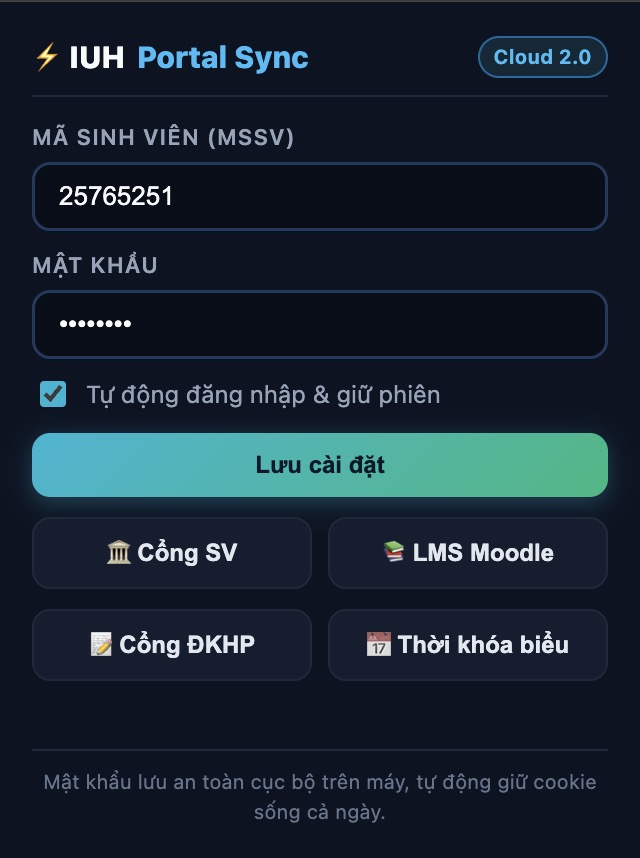
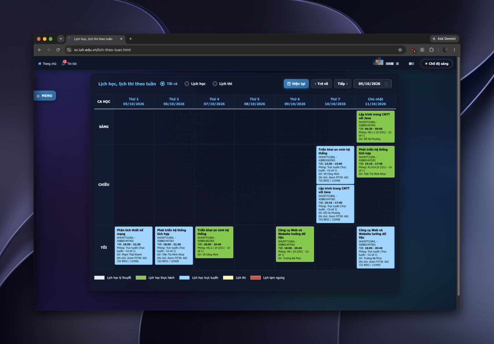
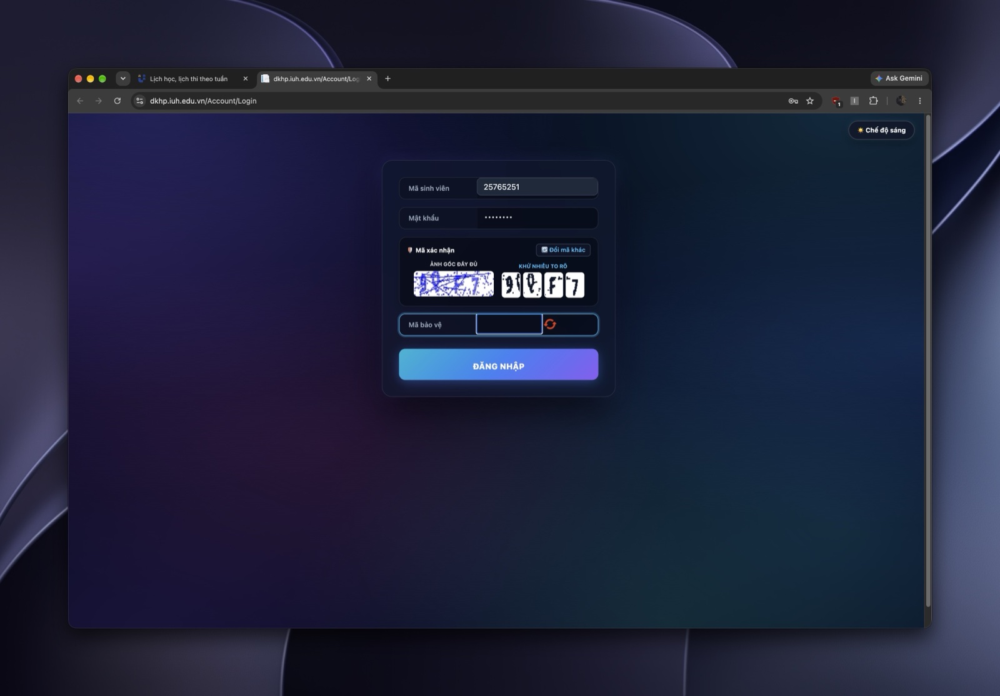
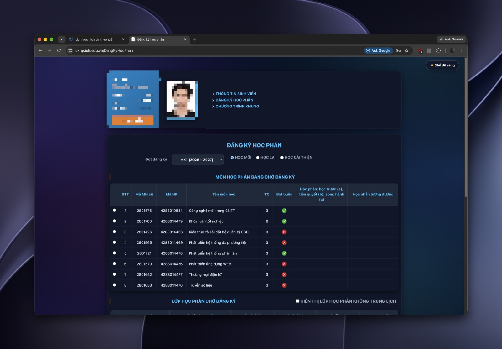

# ⚡ IUH Fast Login & Enhanced Portal Extension

  
  
  
  

Tiện ích mở rộng (Browser Extension) Manifest V3 tự động đăng nhập, giữ sống phiên và tối ưu hóa toàn diện giao diện các cổng thông tin Đại học Công nghiệp TP.HCM (IUH):

- 🏛️ **Cổng sinh viên** (`sv.iuh.edu.vn`) — Tự động vượt captcha ở tầng mạng, tự động đăng nhập.
- 📅 **Thời khóa biểu siêu tối ưu** (`sv.iuh.edu.vn/lich-theo-tuan.html`) — Đổi mới giao diện Dark/Light Mode, mở rộng 100% full width, menu hover trượt mép trái, chia đều 7 cột, chữ đen sắc nét 100%, hiển thị song song số tiết và giờ học cụ thể in đậm phía dưới.
- 📚 **LMS Moodle** (`lms.iuh.edu.vn`) — Tự động điền tài khoản và đăng nhập siêu tốc.
- 📝 **Đăng ký học phần** (`dkhp.iuh.edu.vn`) — Tự động điền tài khoản, giao diện phóng to captcha khử sạch nhiễu hạt 4 ô ký tự, tự động in hoa và tự submit khi gõ đủ 4 ký tự.
- 🔄 **Giữ sống phiên (Session Keepalive)** — Chạy ngầm định kỳ 10 phút ping giữ cookie (`ASC.AUTH`, `.ASPXFORMSAUTH`, `MoodleSession`) để không bao giờ bị timeout sau 20 phút.

---

## 📸 Hình ảnh giao diện thực tế

### 1. Bảng điều khiển Popup tiện ích (⚡ IUH Portal Sync)

  

### 2. Thời khóa biểu tuần Dark Mode Aurora (Mở rộng 100% Full Width & Menu Hover mép trái)

  

### 3. Cổng Đăng ký học phần — Đăng nhập & Captcha phóng to khử nhiễu 4 ô ký tự

  

### 4. Cổng Đăng ký học phần — Giao diện Portal Dark Mode

  

---

## 🚀 Hướng dẫn cài đặt & sử dụng (Dành cho người chỉ cài Extension)

### 🛠️ Bước 1: Cài đặt tiện ích vào trình duyệt (Chỉ làm 1 lần)

#### 👉 Dành cho Chrome, Edge, Cốc Cốc, Brave, Opera:
1. Bạn tải hoặc clone mã nguồn về máy, bạn sẽ thấy thư mục tên là **`extension/`**.
2. Mở trình duyệt, nhập vào thanh địa chỉ:
   - Trên Chrome / Cốc Cốc / Brave: `chrome://extensions`
   - Trên Microsoft Edge: `edge://extensions`
3. Gạt bật công tắc **Chế độ dành cho nhà phát triển (Developer mode)** ở góc trên bên phải.
4. Bấm nút **Tải tiện ích đã giải nén (Load unpacked)** ở góc trên bên trái.
5. Chọn đúng thư mục **`extension/`** vừa tải về.
6. *Mẹo nhỏ:* Bấm vào biểu tượng **Mảnh ghép (Extensions)** trên thanh công cụ trình duyệt rồi bấm **Ghim (Pin 📌)** icon của IUH Fast Login ra ngoài để tiện click mở nhanh.

#### 👉 Dành cho Mozilla Firefox:
1. Mở Firefox, nhập `about:debugging#/runtime/this-firefox` vào thanh địa chỉ.
2. Bấm nút **Load Temporary Add-on…** (Tải tiện ích tạm thời) → Chọn file `extension/manifest.json`.

---

### 🔐 Bước 2: Thiết lập tài khoản ban đầu (Chỉ làm 1 lần)

1. Bấm vào biểu tượng **Tia sét ⚡ IUH Fast Login** trên thanh công cụ trình duyệt.
2. Bảng điều khiển nhỏ (Popup) xuất hiện:
   - **Mã sinh viên:** Nhập mã số sinh viên của bạn (ví dụ: `21000000`).
   - **Mật khẩu:** Nhập mật khẩu Cổng sinh viên của bạn.
   - Tích chọn: **Tự động đăng nhập & giữ phiên**.
3. Bấm **Lưu cài đặt** (xuất hiện dòng chữ xanh *"Đã lưu thông tin"* là hoàn tất).

> 🔒 **Bảo mật an toàn 100%:** Mật khẩu của bạn chỉ lưu trữ cục bộ trong bộ nhớ an toàn của trình duyệt (`chrome.storage.local`), tuyệt đối không gửi về bất kỳ máy chủ nào khác.

---

### 🚀 Bước 3: Trải nghiệm các tính năng hằng ngày

#### 1. Truy cập nhanh qua Popup 1-Click
Bất cứ lúc nào bạn bấm vào icon tiện ích, có sẵn 4 nút truy cập tốc độ cao:
* 🏛️ **Cổng SV**: Mở cổng sinh viên. Nếu đã có phiên, tiện ích sẽ đưa bạn vào thẳng Dashboard.
* 📚 **LMS Moodle**: Mở thẳng trang học trực tuyến LMS Moodle.
* 📝 **Cổng ĐKHP**: Mở cổng Đăng ký học phần. Nếu phiên còn sống, sẽ tự vào thẳng trang đăng ký học phần.
* 📅 **Thời khóa biểu**: Mở thẳng trang Lịch học tuần với giao diện nâng cao tràn viền.

#### 2. Tự động đăng nhập siêu tốc & Bỏ qua Captcha
* **Tại Cổng sinh viên (`sv.iuh.edu.vn`):**
  - Tự động chặn ảnh captcha ở tầng mạng, server trường tự động bỏ qua kiểm tra captcha.
  - Tự động điền MSSV, mật khẩu và đăng nhập ngay khi mở trang mà không cần thao tác tay.
* **Tại LMS Moodle (`lms.iuh.edu.vn`):**
  - Tự động điền tài khoản và đăng nhập ngay lập tức.
* **Tại Cổng ĐKHP (`dkhp.iuh.edu.vn`):**
  - Tự động điền sẵn MSSV và Mật khẩu.
  - Mã captcha được phóng to và **khử sạch nhiễu hạt, chia thành 4 ô ký tự to rõ** giúp bạn nhìn cực dễ.
  - Bạn chỉ cần gõ 4 chữ cái (tiện ích **tự chuyển thành chữ IN HOA**). Ngay khi bạn gõ xong chữ thứ 4, tiện ích sẽ **tự động bấm Đăng nhập luôn**, giúp bạn đăng ký môn cực nhanh!

#### 3. Giữ phiên đăng nhập sống cả ngày (Session Keepalive)
* Bình thường, nếu không thao tác khoảng 20 phút thì cổng trường sẽ tự out và bắt đăng nhập lại.
* Khi cài tiện ích, hệ thống ngầm sẽ **tự động gửi tín hiệu giữ phiên 10 phút/lần**. Bạn có thể treo máy làm việc cả ngày mà không lo bị văng ra ngoài.

#### 4. Giao diện Thời khóa biểu mới (`sv.iuh.edu.vn/lich-theo-tuan.html`)
Khi bạn vào trang Lịch theo tuần, giao diện đã được nâng cấp toàn diện:
* 🌙 / ☀️ **Đổi giao diện Dark / Light Mode:**
  - Nút **`☀️ Chế độ sáng` / `🌙 Chế độ tối`** ở góc phải thanh tiêu đề. Bấm 1 click là đổi màu toàn bộ trang, tiện ích tự nhớ chế độ bạn chọn.
* ☰ **Menu Bar thu gọn mép trái:**
  - Thanh menu bên trái được thu gọn vào icon tab **`☰ MENU`** ở sát mép trái màn hình để nhường chỗ cho bảng học.
  - Chỉ cần **rê chuột vào nút `☰ MENU`**, menu sẽ tự động trượt êm ra. Rê chuột trở lại bảng học là menu tự thu gọn lại.
  - Mã QR ứng dụng OneUni vẫn nằm đầy đủ bên dưới menu khi mở ra.
* 📅 **Bảng lịch học mở rộng 100% tràn viền:**
  - Bảng học rộng hơn trước 230px, **7 ngày từ Thứ 2 đến Chủ nhật chia đều tăm tắp**.
  - Toàn bộ chữ trong thẻ môn học là **màu đen sắc nét 100%** dễ đọc.
  - **Hiển thị song song cả Số tiết và Giờ học thực tế ngay phía dưới** (ví dụ dòng trên `Tiết: 1 - 3`, dòng dưới `06:30 - 09:00` in đậm sắc nét).
  - Tên Giảng viên được in đậm rõ ràng.
  - Cột ngày hôm nay tự động phát sáng nổi bật với huy hiệu **`[HÔM NAY]`**.
* 👤 **Menu tài khoản cá nhân:**
  - Click vào tên của bạn ở góc trên bên phải để mở menu: Giao diện nền tối kính mờ sang trọng, chữ trắng rõ nét, có đầy đủ icon (👤 *Thông tin cá nhân*, 🔑 *Đổi mật khẩu*, 🚪 *Đăng xuất* có màu đỏ cảnh báo chống bấm nhầm).

---

### 🔄 Bước 4: Cách cập nhật khi có phiên bản mới
Mỗi khi có bản cập nhật mới từ tác giả:
1. Bạn chỉ cần tải/kéo code mới về đè vào thư mục `extension/`.
2. Vào `chrome://extensions` bấm nút **Làm mới (Reload 🔄)** trên thẻ tiện ích IUH Fast Login là mọi tính năng mới sẽ được cập nhật ngay lập tức!

---

## 🛠️ Cơ chế kỹ thuật & Tối ưu hiệu năng

1. **Triệt tiêu chớp nháy (0ms FOUC)**:
   - Các content script (`schedule.js`, `dkhp.js`, `redirect.js`) chạy tại `document_start`.
   - CSS Theme được tiêm đồng bộ ngay lập tức trước khi trình duyệt render frame đầu tiên, triệt tiêu hoàn toàn hiện tượng chớp trắng rồi mới đổi màu.
2. **Tăng tốc phần cứng GPU (Hardware Composite Acceleration)**:
   - Gán `will-change: transform; backface-visibility: hidden;` cho các thành phần động (`.iuh-sidebar-drawer`, `#iuh-sidebar-trigger-btn`).
   - Đảm bảo hiệu ứng trượt mở luôn đạt 60fps mượt mà trên mọi thiết bị.
3. **Giảm tải CPU với Targeted MutationObserver**:
   - Thay vì quan sát toàn bộ `document.body`, observer chỉ theo dõi riêng vùng bảng lịch `#viewLichTheoTuan`.
   - Kết hợp dirty-checking và bộ nhớ đệm cache (`highlightTodayColumn`, `equalizeColumns`, `fixBrokenText`), giảm thời gian xử lý xuống chỉ còn **~0.79ms**.
4. **Bảo mật tuyệt đối**:
   - Thông tin tài khoản chỉ lưu cục bộ trên máy bạn (`chrome.storage.local`), không gửi đi bất kỳ máy chủ nào khác.

---

Phát triển với ❤️ cho sinh viên Đại học Công nghiệp TP.HCM (IUH).

